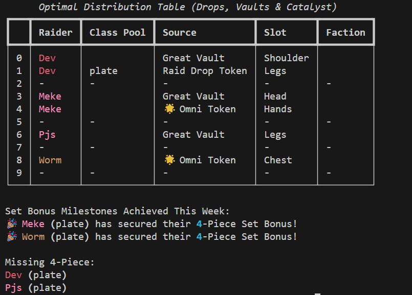

# WoW-Tier-Optimizer

Optimizes the distribution of World of Warcraft Tier items across a raid group taking into account the following criteria:
- Great Vault Options (Including only being able to select one option)
- Number of Catalyst Charges
- Character's already owned tier items
- Dropped Tier Tokens
    - Omni Tokens
    - Faction Specific LFR Tokens
- Power Weight (Include a power multiplier to weight certain players higher)

See [Background Information](#Background-Information) for more about the formula.

## Installation

Requirements:
- Python 3.14 - You may be able to use an older version but it only tested on 3.14

```bash
pip install -r requirements.txt
```

## Usage

```bash
python main.py
```

### Output

The full output includes a table showing the distribution of tier (including the optimal choices - Omni, Catalyst, Great Vault, and Drops), everyone who obtained their tier set, and those still missing their tier set.



## Background Information

This optimizer uses the Mathematical Modeling method called [Linear Programming](https://en.wikipedia.org/wiki/Linear_programming). Linear Programming (LP) is used to obtain the best outcome either through maximization or minimization. Every LP problem has three components: decision variables, objective function, and constraints. More information about LP can be found at these following resources: [Linear Programming YouTube Explanation Video](https://www.youtube.com/watch?v=Bzzqx1F23a8) and [MIT Paper Introduction](https://math.mit.edu/~goemans/18310S15/lpnotes310.pdf).

For our particular application we are applying LP through the PULP Python Library in following way:

**Goal**: We are maximizing the amount of 4-piece tier sets created.
**Decision Variables**: 
- Tokens
- Vault Tokens
- Catalyst
- Omni Token
- LFR Token
- 4-PC

**Constraints**: 
- Cannot assign more tier than has dropped per armor group. 
- Cannot assign more Faction specific LFR tier token per faction and per armor group.
- Cannot assign more Omni tokens than has dropped. 
- Cannot assign raider great vault and catalyst options that do not exist.
    - Also we do not want to take a helm from great vault and use a helm tier token. 
- Cannot use more than one Great Vault Option.
- Cannot use more than total number of catalyst chargers.
- We do not want more than 4 - tier pieces.

**Objective Function**: We apply the lpSum for all the decision variables weighted against the player_weights and apply a lower threshold for catalyst to minimize it's usage, this is because we want to consume tokens before catalysts.

## License

[MIT](./LICENSE.txt)
