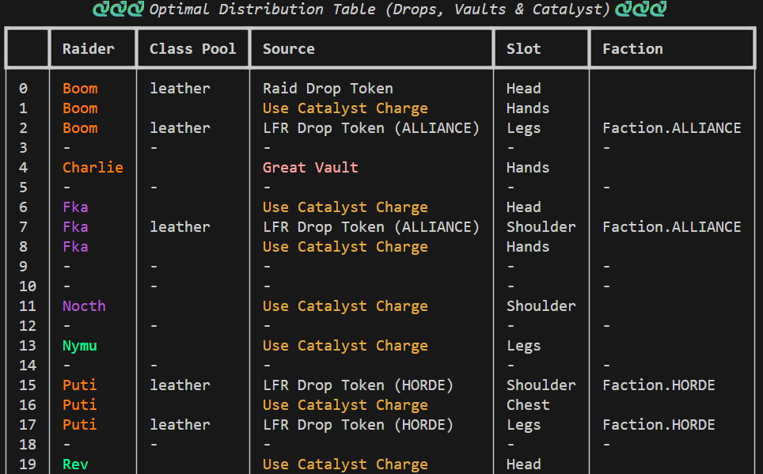
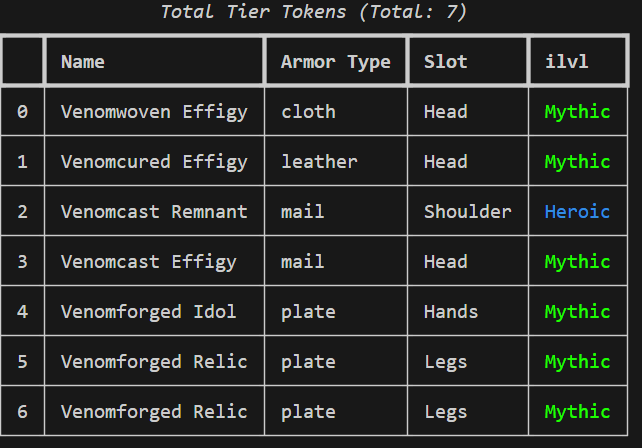
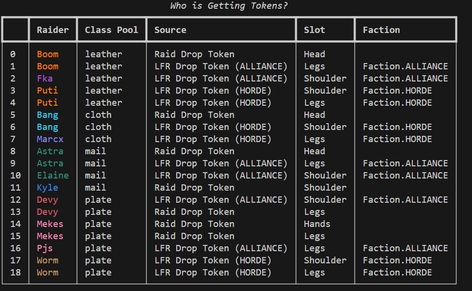
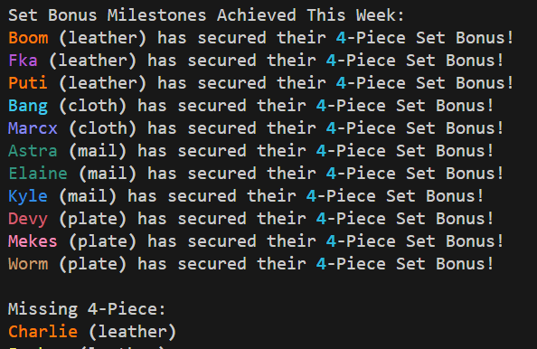

# WoW-Tier-Optimizer

Optimizes the distribution of World of Warcraft Tier items across a raid group taking into account the following criteria:
- Great Vault Options (Including only being able to select one option)
- Number of Catalyst Charges
- Character's already owned tier items
- Dropped Tier Tokens
    - Omni Tokens
    - Faction Specific LFR Tokens
- Power Weight (Include a power multiplier to weight certain players higher)

See [Background Information](#Background-Information) for more about the formula.

## Installation

Requirements:
- Python 3.14 - You may be able to use an older version but it was only tested on 3.14

```bash
pip install -r requirements.txt
```
## Setup
Since this tool was built specifically for my guild you will need to copy that workflow (or make code modifications of your own).

#### Data Requirements and Information

> [!WARNING]
The character names in the `roster_information.json` file must match the names in Googlesheets. Otherwise this will throw an error.

##### External Datasources:
- [LootHoarder (My Fork)](https://github.com/Davis24/LootHoard): LootHoarder records all the Epic loot that drops in raid. This is used to generate the number of tokens for each armor type and slot. We export the CSV from this addon to be parsed.
- GoogleSheets: Currently, there isn't a clean way (without everyone installing an addon) to track tier tokens in the vault. We rely on our raiders to input their information into a GoogleSheets a copy can be found [here](https://docs.google.com/spreadsheets/d/1f_0C3Zbrlt-i4pplJL0wYrj9coTwe6NrvfMDRLLRz5s/edit?usp=sharing).
    - Most of these tabs are unused but we're sticking with this format for now.

#### Data How-Tos

With the collected data we need to update the following files before running the script. 

1. `/input/roster_information.json`: Update this information regarding your raiders. See the [Roster Information Section](#roster_information-JSON-Attributes) for detailed information about each attribute.
2. `/input/vault_input.csv` : This file comes from our GoogleSheets template. With the GoogleSheets document open go to File &rarr; Download &rarr; CSV. Rename the file to `vault_input.csv` or copy and paste the contents.
3. `/input/raid_loot.csv`: This is the data we export from the LootHoarder fork addon. Open the addon &rarr; Export &rarr; Copy and Paste. Replace all the data in the `raid_loot.csv` file.

## Run

```bash
python main.py
```

### Output

The full output includes three tables: 
- The distribution of tier (including the optimal choices - Omni, Catalyst, Great Vault, and Drops)
- Total tier token drops
- Who is Getting Tier

Lastly, it includes text output on who obtained 4-piece and who did not.






## Background Information

This optimizer uses the Mathematical Modeling method called [Linear Programming](https://en.wikipedia.org/wiki/Linear_programming). Linear Programming (LP) is used to obtain the best outcome either through maximization or minimization. Every LP problem has three components: decision variables, objective function, and constraints. More information about LP can be found at these following resources: [Linear Programming YouTube Explanation Video](https://www.youtube.com/watch?v=Bzzqx1F23a8) and [MIT Paper Introduction](https://math.mit.edu/~goemans/18310S15/lpnotes310.pdf).

For our particular application we are applying LP through the PULP Python Library in following way:

**Goal**: We are maximizing the amount of 4-piece tier sets created.
**Decision Variables**: 
- Tokens
- Vault Tokens
- Catalyst
- Omni Token
- LFR Token
- 4-PC

**Constraints**: 
- Cannot assign more tier than has dropped per armor group. 
- Cannot assign more Faction specific LFR tier token per faction and per armor group.
- Cannot assign more Omni tokens than has dropped. 
- Cannot assign raider great vault and catalyst options that do not exist.
    - Also we do not want to take a helm from great vault and use a helm tier token. 
- Cannot use more than one Great Vault Option.
- Cannot use more than total number of catalyst chargers.
- We do not want more than 4 - tier pieces.

**Objective Function**: We apply the lpSum for all the decision variables weighted against the player_weights and apply a lower threshold for catalyst to minimize it's usage, this is because we want to consume tokens before catalysts.

## LootHoard

I've modified this [addon](https://github.com/Davis24/LootHoard) to include difficulty and clean-up some of the CSV breaking issues. My version: [LootHoard](https://github.com/Davis24/LootHoard)

## roster_information JSON Attributes

Lets take a look at the `roster_information.json` file and what each attribute is used for. 

#### Basic Structure 
At a high-level the JSON structure is the following
```
armor_type
    character_name
        class
        type
        faction
        current_tier
        vault_options
        catalyst_charges
        player_weights
```
For each armor_type and character_name we have sub information.

| Attribute | Type | Example | Usage |
|---|---|---:|---|
| `class` | `String` | `MAGE` | Used for color coding the output |
| `type` | `String` | `DPS` | Unused - at the moment. |
| `faction` | `String` | `HORDE` | Used for the LFR token distribution and the Linear Programming (LP) algorithm. |
| `current_tier` | `Array[String]` | `["Head", "Shoulders"]` | This _needs_ to be included for proper JSON format but is overwritten by the data in the `vault_input.csv` file by the main script. Used by LP algorithm. |
| `vault_options` | `Array[String]` | `[]` | This _needs_ to be included for proper JSON format but is overwritten by the data in the `vault_input.csv` file by the main script. Used for token elimination in distribution. |
| `catalyst_charges` | `int` | `2` | This is likely the same for everyone early on the tier. Recommend setting it to `1` for everyone. Used by LP algorithm. |
| `player_weights` | `decimal` | `1.0` | Use this to weight players higher or lower. Higher means they're more important we are prioritizing them. Lower, lower priority.

#### Example
```json
{
    "cloth_raiders": {
        "Khadgar": {
            "class" : "MAGE",
            "type" : "DPS",
            "faction": "ALLIANCE",
            "current_tier": ["Head"],  
            "vault_options": ["Shoulder"],
            "catalyst_charges": 1,
            "player_weights": 1.0
        }, 
    },
    "plate_raiders":{
        "LICHKING": {
            "class" : "DEATH_KNIGHT",
            "type" : "DPS",
            "faction": "ALLIANCE",
            "current_tier": [],  
            "vault_options": ["Shoulder", "Hands"],
            "catalyst_charges": 1,
            "player_weights": 5.0
        }, 
    }
}
```
## License

[MIT](./LICENSE.txt)
